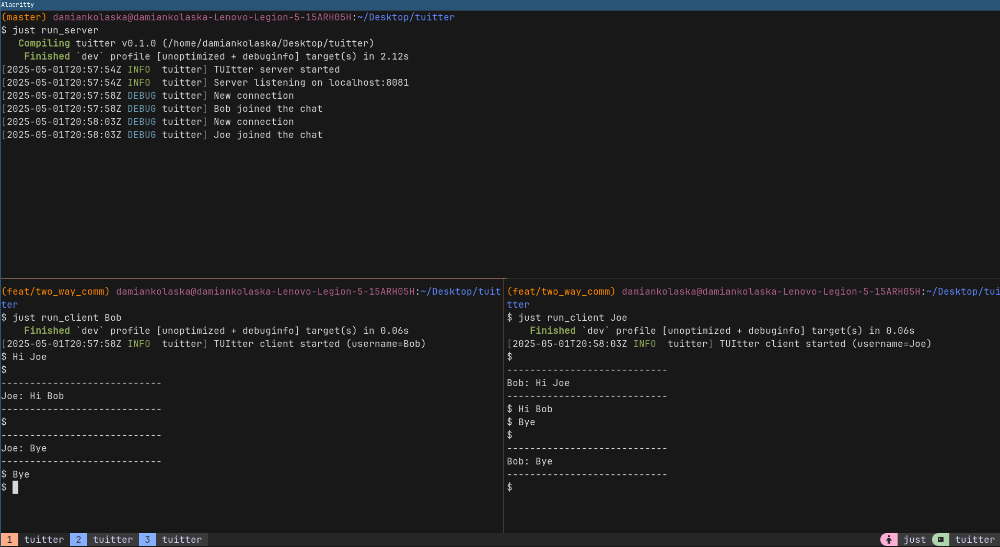

# TUItter

Simple terminal-based chat application written in Rust with Protocol Buffers.

## Prerequisites
* Rust compiler
* [Protocol Buffer Compiler](https://github.com/protocolbuffers/protobuf/releases)
* [just](https://github.com/casey/just)

## How to run

Start server
```
just run_server
```

Start client
```
just run_client Bob
```

## Preview

